 1.1 Oracle中常用的数据类型
=
在Oracle 11g中提供的数据类型有23种。根据表示的数据可以分为4大类：字符型、数字型、日期类型和其它数据类型。下面依次讲解这4大类。 
1.字符型 
字符型在Oracle 11g中有varchar2、char、nchar、nvarchar2和long五种。 
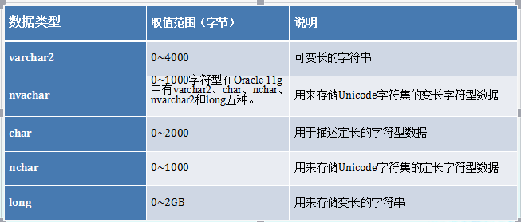 
2.数字型 
数字型在Oracle 11g中常用的有number和float两种，可以用它们来表示整数和小数。 
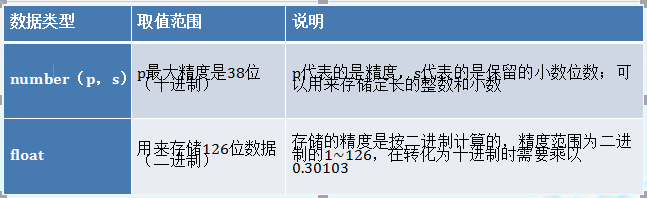 
3.日期类型 
日期类型在Oracle 11g中常用的有date和timestamp两种类型，可以用它们来存放日期和时间。 
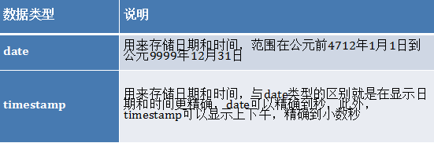 
4.其它数据类型 
除了以上讲的数据类型外，在Oracle 11g中还有存放大数据的数据类型以及存放二进制文件的数据类型。 
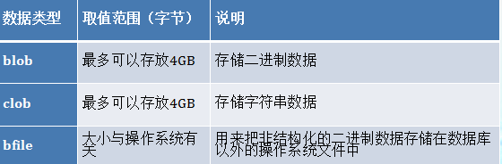 

1.2 创建Oracle数据
==
数据表是存储数据的基本单元。在数据库中，它对应于现实世界中的实体。在Oracle中，有多种类型的表。而一个表中可以存储各种类型的不同数据，除了存储文本和数值数据外，还可以存储日期、二进制数等。本节着重介绍如何创建Oracle数据表. 
 1.2.1 设计数据表 
从用户角度来看，表中存储的的数据逻辑结构是一张二维表，即表由行、列两部分组成。在创建数据表之前，首先我们要设计一个表，确定它的数据类型。 
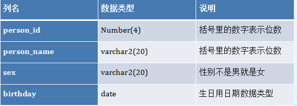 
1.2.2 利用OEM创建数据表 
所谓创建表，实际上就是在数据库中定义表的结构。表的结构主要包括表与列的名称、列的数据类型，以及建立在表或列上的约束. 
创建表可以在SQL Developer中完成，也可以在SQL Plus中使用create table命令来完成，也可以在OEM中完成。本节讲解在OEM中如何创建数据表. 
1.2.3 利用工具创建数据表 
除了企业管理器之外，我们还可以利用SQL Developer工具创建数据表，操作简单、直观、易于掌握。很多数据库管理工具都提供了图形化界面来创建数据表，针对Oracle数据库。 
1.2.4 利用命令创建数据表 
以命令行的方式同样可以创建数据表，其效果与利用工具完全相同，我们可以用前面提到的工具SQL Plus来创建数据表。Oracle提供了SQL语句create table实现数据表的创建。 
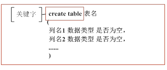 
1.3修改数据表结构
==
数据表一旦创建，并不是一成不变的，允许我们对其进行修改，如添加或删除表中的列、修改表中的列，以及对表进行重命名或重新组织等。修改表时还是可以通过OEM、SQL Developer以及SQL Plus中使用create table命令如何修改数据表结构。 
对于已经建立的表进行修改的情况包括以下几种。 
添加或删除表中的列，或者修改表中的列的定义。 
对表进行重新命名。 
将表移动到其他表空间。 
添加、修改或删除表中的约束条件。 
启用或禁用表中的约束条件、触发器等。 
1.3.1利用OEM修改数据表结构
在OEM中，可以很方便地对表结构进行修改。修改表oemperson，修改字段sex的数据类型为char(2)。 
1.3.2利用工具修改数据表结构 
利用工具修改数据表结构，操作简单、直观。最常用的工具自然是SQL Developer。以5.2节创建的表person为例，利用SQL Developer修改数据表结构。 
1.3.3利用命令查看、修改数据表结构 
使用命令方式同样可以查看、修改数据表结构。Oracle提供了SQL语句DESC实现数据表结构查询，ALTER TABLE进行修改，其语法如图所示。 
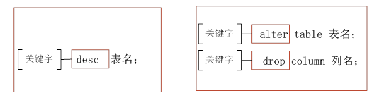

修改表结构包括以下几种情况。 
（1）增加列：如果需要在一个表中保存实体的新属性，需要在表中增加新的列，在一个表中增加一个新列的语法格式如下所示。 
alter   table    table_name   add (column  definition1, column  definition2); 
新添加的列总是位于表的末尾；column  definition部分暴扣列名、列的数据类型以及具有的默认值。用户可以一次性为表增加多个列，各列之间使用逗号进行分隔。 
（2）更改列：如果需要调整一个表中某些列的数据类型、长度和默认值，就需要更改这些列的属性。没有更改的列则不会受任何影响，更改表中现有列的语法格式如下所示。 
alter   table    table_name   modify (column_name1   newdefinition1, column  newdefinition2); 
（3）删除列：当不需要某些列时，可以将其删除，直接删除列的语法如下所示。 
alter   table    table_name   drop (column_name1   , column  ); 
 1.4删除数据表
==
对于维护数据库，另一个可执行的操作就是删除数据表。如果不再需要某个数据表，又不想其一直占用数据库资源，即可执行删除操作。本节将结合工具和命令方式，讲述如何删除数据表 
1.4.1利用drop命令删除数据表 
同样，可以利用SQL语句删除某张表。Oracle提供了SQL语句drop table实现数据表的删除，其语法如图所示 
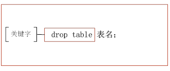 
1.5对数据表中数据的操作 
==
对于数据表中数据的操作无非就是对数据进行添加、修改、删除等操作。本节将用SQL语句来对表中数据添加、修改、删除操作依次进行举例说明. 
 1.5.1 添加数据 
在创建好数据表以后，添加数据就是首先要做的工作。插入数据是指将新的数据添加到数据表中。在给表中添加数据时要与表中字段类型相匹配，也就是说，如果表中的字段是数字类型，那么在向该字段中添加数据时也要添加数字类型数据。 
Oracle提供了SQL语句insert into实现数据的添加，其语法如图所示 
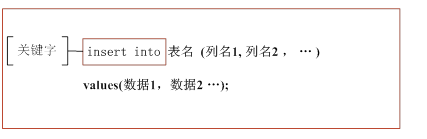 
1.5.2 查看数据 
查看数据表中建好的数据用select语句，查询数据方法种类很多，这节我们介绍一下select语句的简单用法，具体的在本书后面会详细讲解. 
1.5.3 修改数据 
修改数据也是经常使用的，在已经存在数据的表中修改数据使用update语句即可完成。语法如图所示。 
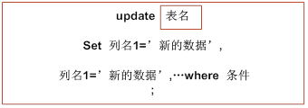 
1.5.4删除数据 
用户管理数据表时，经常要删除数据表中一些没有用的数据，删除数据要使用delete关键字来实现。Oracle提供了SQL语句delete from实现数据的删除，其语法如图所示。使用它可以根据条件删除指定的数据，也可以删除表中全部的数据. 
 
1.6特殊的数据表dual 
==
Oracle中包括非常特殊的数据表——dual。dual表实际属于系统用户sys，具有了数据库基本权限的用户，均可查询该表的内容。通过关键字desc，可以查看该数据表的结构 
2.1表的约束 
==
约束是每个数据库必不可少的一部分。约束的根本目的在于保持数据的完整性，数据完整性是指数据的精确性和可靠性，即数据库中的数据都符合某种预定义规则。当用户输入的数据不符合这些规则时，将无法实现对数据库的更改。本章将主要介绍主键、外键、唯一性、检查、默认值几种约束，并讲解如何利用这些约束保持数据完整性。 
Oracle的主要约束即指列的约束，主要包括主键约束、外键约束、唯一性约束、检查约束、默认值约束、非空约束。表中的约束条件可以保证表中数据的完整性。, 
在Oracle11g中,提供了多种机制来实现数据库的完整性，主要有三种。 
域完整性，是对数据表中字段属性的约束，包括字段的值域、字段的类型及字段的有效规则等约束，是由确定关系结构时所定义的字段的属性决定的。域完整性主要包括not null约束、唯一性约束、检查约束。 
实体完整性，即指关系中的主属性值不能为null且不能有相同值。实体完整性是对关系中的记录唯一性，也就是主键的约束。 
参照完整性，即指关系中的外键必须是另一个关系的主键有效值，或是参照完整性是对关系数据库中建立关联关系的数据表间数据参照引用的约束，也就是对外键的约束。 
2.2主键约束 
=
主键约束是数据库中最常见的约束，可以保证数据完整性。通过将主键纳入查询条件，可以达到查询结果最多返回一条记录的目的。本节将主要介绍主键的添加、删除、使用。 
2.2.1主键简介
==
主键被创建在一个或多个列上，通过这些列的值或者值的组合，唯一地标识一条记录。 
通过为表customersnew添加主键——customer_id，即可保证数据表的数据不会出现重复。这也是我们常说的实体完整性。实体完整性规则是针对现实世界的一个实体集，而现实世界中的实体是可区分的。实体完整性的目的是利用关系模式中的主键或主属性来区分现实世界中的实体集中的实体,所以不能取空值。实体完整性约束是通过定义primary key约束来实现的。定义为primary key约束的列被称为“主鍵列” 
2.2.2 利用命令添加主键约束 
==
主键约束一般在建表时创建，如果建表时没有创建主键约束，我们可以直接添加主键约束。Oracle中提供关键字primary key来实现主键约束的添加，添加主键约束语法如图所示。 
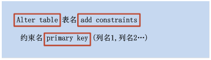 
其中约束名是可省的，如果没有为约束指定名称，那么名称将自动产生；alter table命令用于修改表的属性；primary key(列名1, 列名2…)则指定主键被建立在哪些列之上，各列名之间使用逗号进行分隔。 
注意：主键约束在每一个数据表中只有一个，但是主键约束可以由多个列组成。 
2.2.3主键使用场景 
==
主键是数据表中最常用的约束，其应用场景一般有如下几种： 
（1）对于完整性要求比较高的数据表应该建立主键 
主键可以保证数据在主键列上的唯一性，对于特定的业务逻辑，可以指定相应的主键规则，避免出现错误数据。例如，人员信息数据表，可以考虑以人员的身份证号作为主键，避免出现重复。 
（2）对于经常按照某列进行查询的数据表，应该考虑建立主键 
（3）考虑对外键是否有利 
当用户对基表插入一条记录或者对主键列进行更新操作的时候，关系数据库管理系统将自动进行检査。包括： 
检査主键值是否唯一，如果不唯一则拒绝插入或者修改。 
检查主键的各个属性是否为空，如果有一个为空，则拒绝插入或者修改。 
当在一个表上创建主键之后，向表中添加数据就有了约束。此时，输入数据时表中所有数据在主键列上的值（或值的组合）不能重复，并且主键列上的值不能为空。 
2.2.4修改主键约束
==
主键约束创建之后，可以对其进行属性修改。修改主键约束主要包括两方面的内容：禁用/启用主键和重命名主键。 
1．禁用/启用主键 
在Oracle中，对于任何已经创建好的约束，可以使用ENABLE或者是DISABLE主键来启用约束或者是禁用约束。禁用的约束好像并没有创建约束一样，并没有达到创建约束的目的，但是通过ENABLE子句，可以随时启用约束。禁用/启用数据表主键的语法如图所示。 
 
2．重命名主键 
如果需要修改已有主键的名称，则需要对约束进行重命名，重命名主键的语法如图所示 
 
2.2.5 删除主键约束 
==
如果希望去掉表上的某个约束，可以将其禁用，使其无效，也可以将其删除。如果在表上已经建立了一个约束，现在希望把它改为另一类型的约束，或者希望把它施加在另一个列上，此时约束是不能被修改的，只能先将这个约束删除，然后重新创建。 
1.用命令方式删除主键 
删除约束是通过执行alter命令的drop子句来完成的。删除约束的alter命令的语法格式如图所示。 
 
2  使用SQL Developer删除主键约束 
除了命令方式删除键之外，还可以用SQL Developer删除主键约束。重新为表customersnew表的customer_id这一列添加主键约束。 
2.2.6主键与索引 
==
索引可以优化对表的查询操作。如果用户在数据表的列上创建了主键、而在检索数据时又使用了该索引列，Oracle可以很快的捕获符合条件的记录。数据库中的索引，使数据库无需对这个那个表进行扫描，就可以再其中找到所需的数据。有关索引的详细信息，将在以后的章节讲解 
2.3外键约束 
=
外键约束可以保证使用外键约束的数据库列与所引用的主键约束的数据列一致，外键约束在一个数据表中可以有多个。本节将主要介绍外键的创建、删除、使用。 
2.3.1外键简介 
=
foreign key约束即外键约束，通过使用外键，保证表与表之间的参照完整性。定义了foreign key约束的列称为“外键列”，被foreign key约束引用的列称为“引用列”。包含外键的表称为子表，也称为引用表，包含引用列的表称为父表，也称为被引用表，通过使用公共列在表之间建立一种父子关系。在表上定义的外键可以指向主键或者其他表的唯一键。 
2.3.2添加外键约
=
创建外键，首先在主表中创建主键，因为当使用外键寻找主表中记录时，必须要找到唯一一条，所以必须在主表中使用主键来标识记录的唯一性。 
在Oracle中提供关键字foreign key来实现外键约束的添加。 
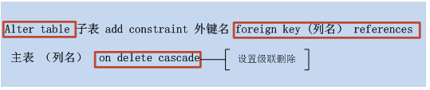 
修改外键约束

